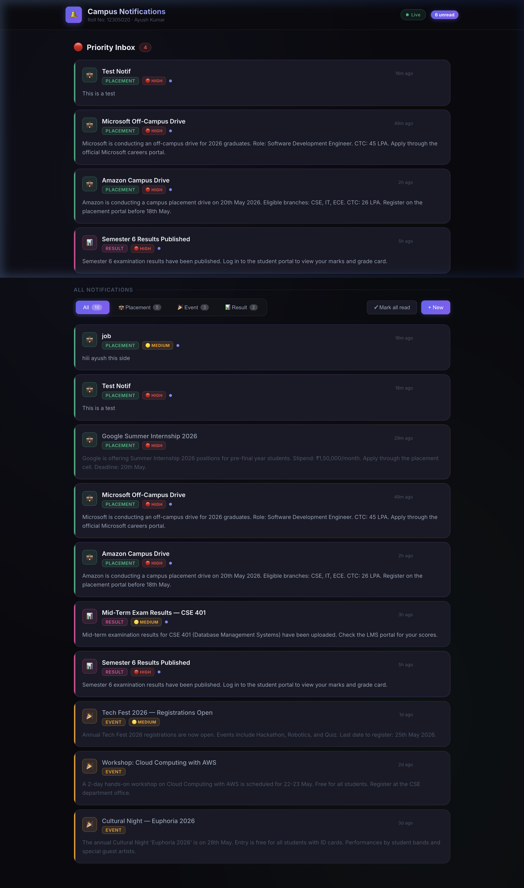
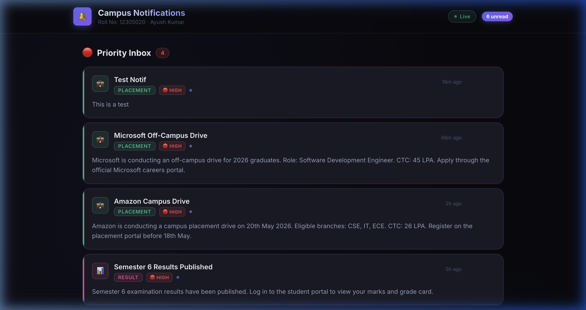
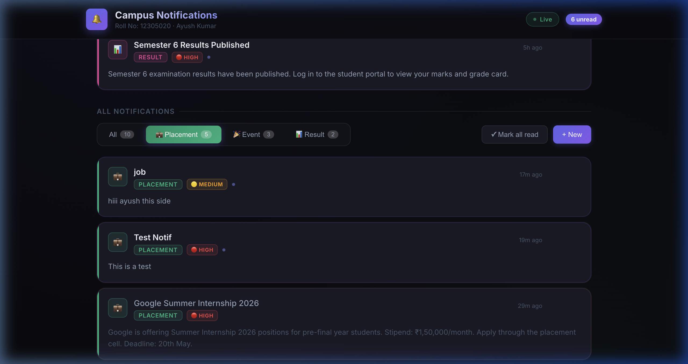
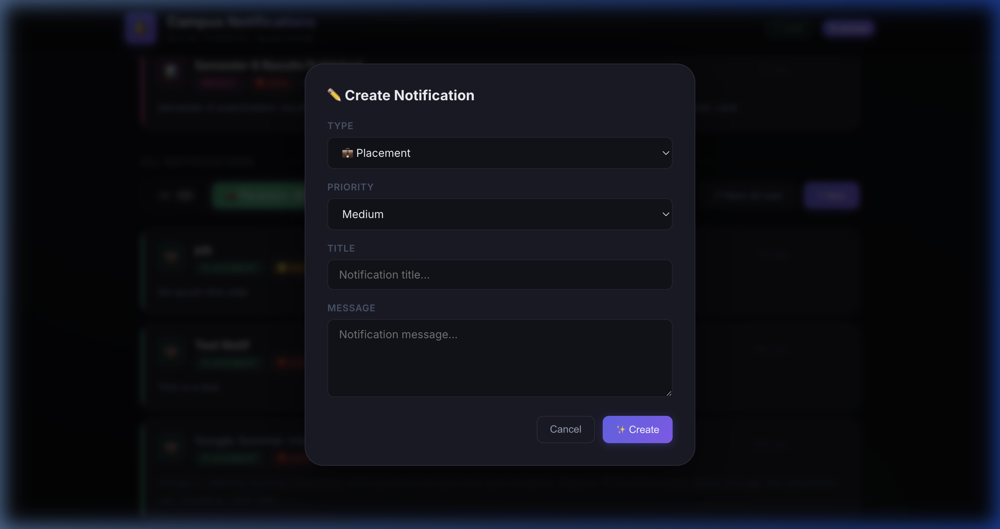

# Campus Notification Platform

A full-stack campus notification platform where students receive real-time updates on **Placements**, **Events**, and **Results**.

## Screenshots

### Dashboard — All Notifications


### Priority Inbox


### Placement Filter


### Create Notification


---

## Tech Stack

- **Frontend**: React 19, Vite, Vanilla CSS
- **Backend**: Node.js, Express
- **Real-time**: Server-Sent Events (SSE)
- **Logging**: Custom middleware → Afford Medical evaluation service

## Features

- 🔴 **Priority Inbox** — unread high-priority notifications surfaced at the top
- 🗂️ **Tabbed filtering** — All / Placement / Event / Result with live counts
- ⚡ **Real-time SSE** — new notifications push instantly without polling
- ✏️ **Create notifications** — type, priority, title, message
- ✓ **Mark read / delete** — per-card and bulk actions
- 📋 **Logging middleware** — every request/response logged to evaluation service

## Running Locally

```bash
# Backend (port 3000)
cd notification_app_be
npm install
npm run dev

# Frontend (port 5173)
cd notification_app_fe
npm install
npm run dev
```

## API Endpoints

| Method | Endpoint | Description |
|--------|----------|-------------|
| GET | `/api/notifications` | List with filter & pagination |
| GET | `/api/notifications/priority-inbox` | Unread high-priority |
| GET | `/api/notifications/stream` | SSE real-time stream |
| POST | `/api/notifications` | Create notification |
| PATCH | `/api/notifications/read-all` | Mark all as read |
| GET | `/api/notifications/:id` | Get single |
| PATCH | `/api/notifications/:id/read` | Mark read/unread |
| DELETE | `/api/notifications/:id` | Delete |
